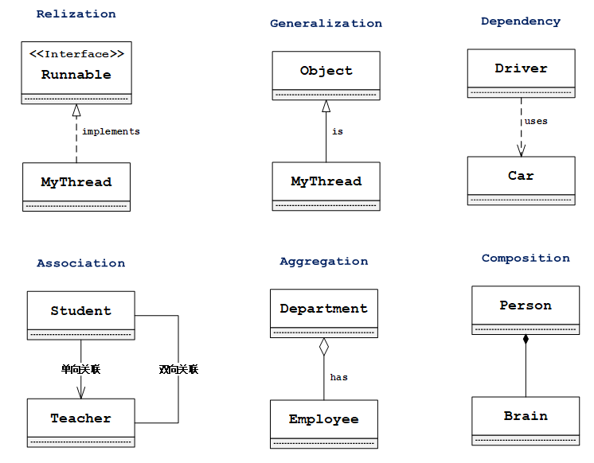
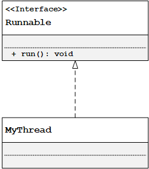

## 1.软件设计原则

**OOP设计原则：**

1. `OCP（Open-Closed Principle）`，开闭原则：软件实体应该对扩展开放、修改封闭。是其它设计原则的最终目的.

实现: 将变化剥离,合理的区分系统中的可变性.

2. `DIP(Dependency Inversion Principle)`，依赖倒置原则：摆脱面向过程编程思想中高层模块依赖于低层实现，抽象依赖于具体细节。OOP中要做到的是，高层模块不依赖于低层模块实现，二者都依赖于抽象；抽象不依赖于具体实现细节，细节依赖于抽象。
   实现：应该通过抽象耦合的方式，使具体类最大可能的仅与其抽象类（接口）发生耦合；程序在需要引用一个对象时,应当尽可能的使用抽象类型作为变量的静态类型,这就是针对接口编程的含义。

3. `LSP(Liskov Substitution Principle)`，里氏替换原则：继承思想的基础。“只有当衍生类可以替换掉基类，软件单位的功能不会受到影响时，基类才真正被复用，而衍生类也才能够在基类的基础上增加新的行为。”

   实现: 尽量不重写父类方法, 方法重载/覆盖时要保证入参类型更宽松, 返回值类型更严格(目的是让子类能够替换父类功能).

4. `ISP（Interface Insolation Principle）`，接口隔离原则：接口功能单一，避免接口污染。
   实现：一个类对另外一个类的依赖性应当是建立在最小的接口上的。使用多个专门的接口比使用单一的总接口要好。

5. `SRP(Single Resposibility Principle)`，单一职责原则：就一个类而言，应该仅有一个引起它变化的原因。 如果一个类的职责过多，就等于把这些职责耦合在一起，一个职责的变化可能会抑止这个类完成其他职责的能力。

6. `CARP（Composite/Aggregate Reuse Principle）`，合成/聚合复用原则：设计模式告诉我们对象委托优于类继承，从UML的角度讲，就是关联关系优于继承关系。尽量使用合成/聚合、尽量不使用继承。
   实现：在一个新的对象里面使用一些已有的对象，使之成为新对象的一部分，以整合其功能。

7. `LoD(Law Of Demeter or Principle of Least Knowledge)`，迪米特原则或最少知识原则：就是说一个对象应当对其他对象尽可能少的了解。即只直接与朋友通信，或者通过朋友与陌生人通信。
   实现：
   （1）在类的划分上，应当创建有弱耦合的类。类之间的耦合越弱，就越有利于复用。
   （2）在类的结构设计上，每一个类都应当尽量降低成员的访问权限。一个类不应当public自己的属性，而应当提供取值和赋值的方法让外界间接访问自己的属性。
   （3）在类的设计上，只要有可能，一个类应当设计成不变类。
   （4）在对其它对象的引用上，一个类对其它对象的引用应该降到最低。
   （5）尽量限制局部变量的有效范围.  

## 2.UML类图

统一建模语言(Unified Modeling Language，UML)是一种为面向对象系统的产品进行说明, 可视化的建模语言.

### 1.UML类关系

类/接口关系共有六种类型，分别是实现关系、泛化关系、依赖关系、关联关系、聚合关系、组合关系.

1. `Relization` 实现关系, 表现为接口的实现implements.
2. `Generalization` 泛化关系, 表现为类的继承extends.
3. `Dependency` 依赖关系, A references(use-a) B (as a method parameter or return type), B的改变会影响A, A的改变不影响B.
4. `Association` 关联关系,表示对象之间的相关性, one-to-one, one-to-many 等.
5. `Aggregation` 聚合关系, Association关系的一种, A has-a C object(as a member variable).
6. `Composition` 组合关系, Aggregation关系的一种, objects don’t have an independent lifecycle.

### 2.UML类示例

**自定义MyThread实现Runnable接口**

属性表示方法:

- `+`：public
- `-`：private
- `#`：protected
- `空`：default

## 3.设计模式

面向对象软件设计中, 用于解决常见问题的典型方案. 设计模式主要分为三类:

1. `creational pattern`:创建型模式, 隐藏对象创建逻辑, 提供灵活的对象创建机制.
2. `structural pattern`:结构型模式, 通过类的组装, 对类功能进行增强, 并使得系统结构灵活高效.
3. `behavioral pattern`:行为型模式, 主要关注点在算法和对象间的职责分配(**communication between objects**).

## 4.常见对象分类

- `VO（View Object）`：视图对象，用于展示层，它的作用是把某个指定页面（或组件）的所有数据封装起来。
- `DTO（Data Transfer Object）`：数据传输对象，这个概念来源于J2EE的设计模式，原来的目的是为了EJB的分布式应用提供粗粒度的数据实体，以减少分布式调用的次数，从而提高分布式调用的性能和降低网络负载，通常，泛指用于展示层与服务层之间的数据传输对象。
- `DO（Domain Object）`：领域对象，就是从现实世界中抽象出来的有形或无形的业务实体。
- `PO（Persistent Object）`：持久化对象，它跟持久层（通常是关系型数据库）的数据结构形成一一对应的映射关系，如果持久层是关系型数据库，那么，数据表中的每个字段（或若干个）就对应PO的一个（或若干个）属性。