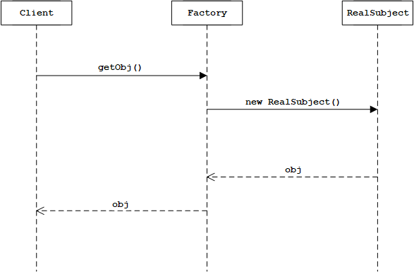
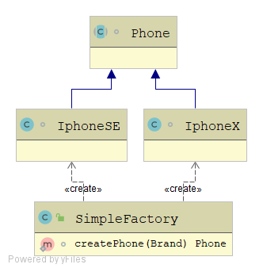
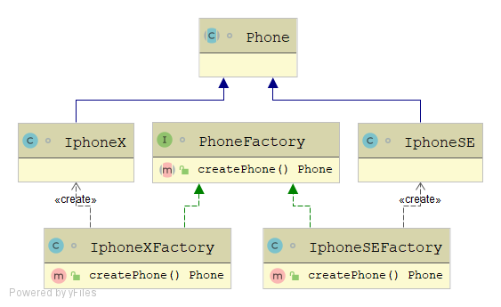
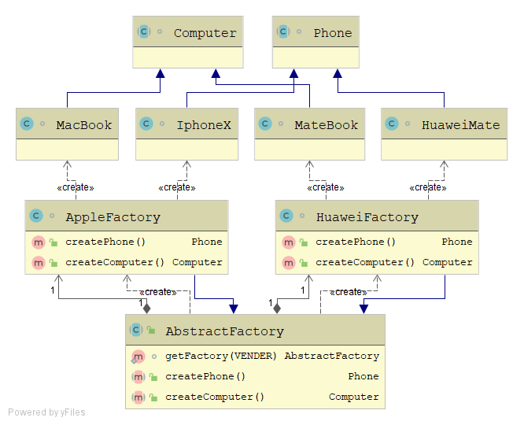
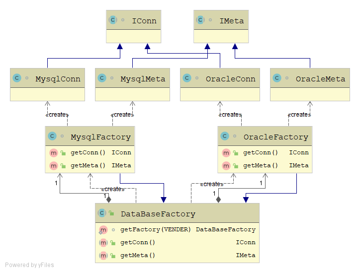
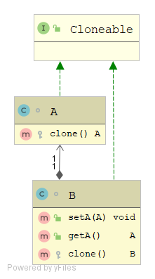
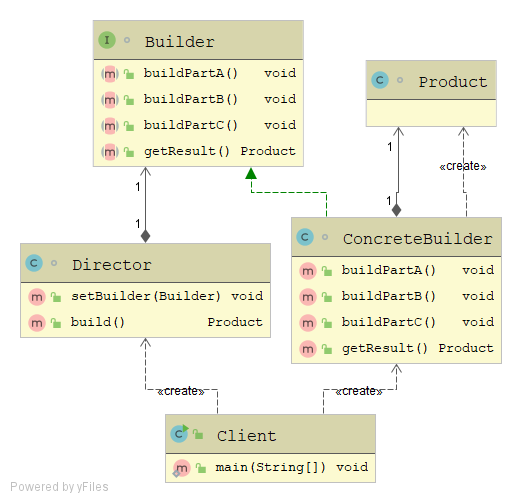
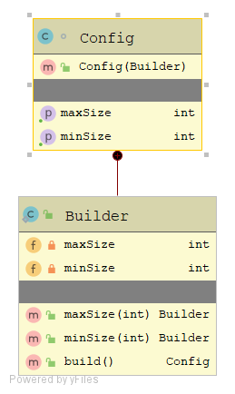

## 创建型模式 Creational Patterns


### 1.单例模式

不能对外暴露实体类构造方法, 无论是哪一种单例方法, 构造器都为私有.

#### 类加载

理解单例模式的多种方式异同, 必须了解类加载机制.

触发类加载: 第一次使用到类

1. new创建对象
2. 子类被创建
3. 使用静态属性
4. 使用静态方法
5. 反射创建

类加载步骤:

1. 加载字节码文件, 生成对应类的Class数据结构.
2. 连接阶段:a.验证 b.准备(静态成员变量赋默认值) c.解析
3. 初始化, 给静态成员变量赋初始值


#### 1.饥汉模式

类加载过程, JVM保证线程安全.

```java
public class EagerSingleton {
    // 类加载时就会触发, 可能用不到instance变量
    private static volatile EagerSingleton instance = new EagerSingleton();
 
    // private constructor
    private EagerSingleton() {
    }
 
    public static EagerSingleton getInstance() {
        return instance;
    }
}
```


#### 2.静态代码块

```java
public class StaticBlockSingleton {
    private static final StaticBlockSingleton INSTANCE;
 
    // 类加载时就会触发, 无论能不能用到
    static {
        try {
            INSTANCE = new StaticBlockSingleton();
        } catch (Exception e) {
            throw new RuntimeException("Uffff, i was not expecting this!", e);
        }
    }
 
    public static StaticBlockSingleton getInstance() {
        return INSTANCE;
    }
 
    // private constructor
    private StaticBlockSingleton() {
        // ...
    }
}
```


#### 3.懒汉模式

```java
/**
1. 自己控制线程安全
2. double check
3. 防止指令重排
*/
public class LazySingleton {
    // volatile 防止instance创建时指令重排, 导致使用未初始化的实例(已经被引用赋值)
    private static volatile LazySingleton instance = null;
 
    // private constructor
    private LazySingleton() {
    }
 
    public static LazySingleton getInstance() {
        if (instance == null) {
            synchronized (LazySingleton.class) {
                // Double check
                if (instance == null) {
                    instance = new LazySingleton();
                    // 字节码, 优化时2,3可能会出现指令重排
                    // 1.分配空间
                    // 2.初始化
                    // 3.引用赋值
                }
            }
        }
        return instance;
    }
}
```


#### 4.静态内部类

```java
public class BillPughSingleton {
    // private constructor
    private BillPughSingleton() {
    }
 
    // 调用getInstance时才会触发, 简单且高效
    private static class LazyHolder {
        private static final BillPughSingleton INSTANCE = new BillPughSingleton();
    }
 
    public static BillPughSingleton getInstance() {
        return LazyHolder.INSTANCE;
    }
}
```


#### 5.枚举类

```java
public enum EnumSingleton {
    INSTANCE;
    public void someMethod(String param) {
        // some class member
    }
}
```


#### 6.推荐用法

为了实现单例模式，其核心就是确保单例对象的唯一性。需要重点关注几个关键点。

- 无法通过new来随意创建对象，构造函数为private
- 提供获取唯一实例对象的方法
- 多线程并发的情况下保证唯一
- 避免反射创建单例对象
- 避免通过序列化创建单例对象

```java
public class DemoSingleton implements Serializable {
    private static final long serialVersionUID = 1L;

    // private constructor
    private DemoSingleton() {
        // 不允许多次调用(反射会绕过private限制)
        if (getInstance() != null){
            throw new RuntimeException("此对象不能被重复构建!");
        }
    }

    private static class DemoSingletonHolder {
        public static final DemoSingleton INSTANCE = new DemoSingleton();
    }

    public static DemoSingleton getInstance() {
        return DemoSingletonHolder.INSTANCE;
    }

    // 去反序列化影响, 实现readResolve签名
    protected Object readResolve() {
        return getInstance();
    }
}
```


### 2. 工厂模式

时序:



#### 简单工厂

示例: 



代码:

```java
abstract class Phone {}

class IphoneX extends Phone {}

class IphoneSE extends Phone {}

enum Brand {
    IPHONEX, IPHONESE
}

public class SimpleFactory {
    static Phone getPhone(Brand brand) {
        return switch (brand) {
            case IPHONEX -> new IphoneX();
            case IPHONESE -> new IphoneSE();
            default -> null;
        };
    }
}
```

使用:

```java
Phone phone = SimpleFactory.getPhone(Brand.IPHONEX);
```

扩展: 新增IphoneXR产品

```java
// 新增IphoneXR类
class IphoneXR extends Phone{}

// 修改SimpleFactory代码, 不符合开闭原则
case IPHONEXR -> new IphoneXR();
```


#### 工厂方法


示例:



代码:

```java
abstract class Phone {}

class IphoneX extends Phone {}

class IphoneSE extends Phone {}

class IphoneXFactory implements PhoneFactory {
    @Override
    public Phone createPhone() {
        // TODO
        return new IphoneX();
    }
}

class IphoneSEFactory implements PhoneFactory {
    @Override
    public Phone createPhone() {
        // TODO
        return new IphoneSE();
    }
}

interface PhoneFactory {
    Phone createPhone();
}
```

使用:

```java
PhoneFactory factory = new IphoneXFactory();
Phone phone = factory.createPhone();
```

扩展: 新增IphoneXR产品

```java
// 新增IphoneXR类
class IphoneXR extends Phone{}

// 新增PhoneXRFactory, 符合开闭原则
class IphoneXRFactory implements PhoneFactory{}
```

工厂方法模式符合OOP开闭设计原则, 但复杂提升.

### 3.抽象工厂

**创建多个产品族无关的产品等级的实例(平台无关性). 更高层次的抽象**

理解产品等级, 产品族两个概念.

- 产品族: HUAWEI手机, HUAWEI电脑属于HUAWEI产品族.

- 产品等级: 小米手机,HUAWEI手机属于手机的产品等级.

示例:



代码:

```java
abstract class Phone {}
abstract class Computer {}

class IphoneX extends Phone {}

class MacBook extends Computer {}

class HuaweiMate extends Phone {}

class MateBook extends Computer {}


class AppleFactory extends AbstractFactory {
    @Override
    public Phone createPhone() {
        return new IphoneX();
    }

    @Override
    public Computer createComputer() {
        return new MacBook();
    }
}

class HuaweiFactory extends AbstractFactory {
    @Override
    public Phone createPhone() {
        return new HuaweiMate();
    }

    @Override
    public Computer createComputer() {
        return new MateBook();
    }
}

enum VENDER {
    APPLE, HUAWEI
}

public abstract class AbstractFactory {
    private static final AppleFactory APPLE_FACTORY = new AppleFactory();
    private static final HuaweiFactory HUAWEI_FACTORY = new HuaweiFactory();

    // Returns a concrete factory object that is an instance of the
    // concrete factory class appropriate for the given vender.
    static AbstractFactory getFactory(VENDER VENDER) {
        AbstractFactory factory = switch (VENDER) {
            case APPLE -> APPLE_FACTORY;
            case HUAWEI -> HUAWEI_FACTORY;
            default -> null;
        };
        return factory;
    }

    public abstract Phone createPhone();

    public abstract Computer createComputer();
}

```

使用:

```java
AbstractFactory factory = AbstractFactory.getFactory(VENDER.APPLE);
Phone phone = factory.createPhone();
```

扩展:

1. 需要新增小米产品族.

```java
// 新增XiomiFactory
// 修改AbstractFactory, getFactory方法增加Xiaomi的判断.
```

2. 新增一个Router路由器产品等级

```java
// 抽象工厂新增createRouter() 方法
// 所有产品族实现createRouter()方法
// ? Apple没有路由器产品, 方法实似乎不合适
// 原则上是将变化分离, 这种情况考虑变化因素应该是产品族, 而非产品等级
```

3. 更多示例:



很明显抽象工厂的意义, 就是对多个产品族的产品等级,进行抽象.

### 4.原型模式

基于一个对象,创建具有相同属性值(information)的对象, 创建后的对象彼此独立. 

对象的深拷贝==deepcopy==. 拷贝对象时需要将属性中可变引用类型也进行拷贝.

#### 递归深拷贝

示例:



代码:

```java
class A implements Cloneable{
    @Override
    protected A clone() throws CloneNotSupportedException {
        return (A) super.clone();
    }
}

class B implements Cloneable{
    private A a;

    public void setA(A a) {
        this.a = a;
    }

    public A getA() {
        return a;
    }

    @Override
    protected B clone() throws CloneNotSupportedException {
        B copy = (B) super.clone();
        copy.setA(a.clone());
        return copy;
    }
}
```

使用:

```java
B b1 = new B();
b.setA(new A(););

B b2 = b1.clone();
// 深拷贝, 引用类型成员引用不同的对象
System.out.println(b1.getA());
System.out.println(b2.getA());

// A@2f4d3709
// A@4e50df2e
```

扩展:

- 如果对象特别复杂, 包含很多个引用属性, 引用属性本身又包含其它引用属性.(递归), 显然这种方式工作量太多.
- 可以使用, 序列化反序列化方式实现深拷贝.

#### 序列化方式

通过序列化, 反序列化过程, 实现**deepcopy**的效果.(所有使用的引用类型都要支持序列化)

```java
// 所有引用必须包含Serializable签名

class C implements Serializable{

}

class D implements Cloneable, Serializable {
    static final long serialVersionUID = 42L;

    private C c;

    public C getC() {
        return c;
    }

    public void setC(C c) {
        this.c = c;
    }

    @Override
    protected Object clone() throws CloneNotSupportedException {
        // 对象序列化
        ByteArrayOutputStream bos = new ByteArrayOutputStream();
        try {
            ObjectOutputStream oos = new ObjectOutputStream(bos);
            oos.writeObject(this);
            oos.close();
        } catch (IOException e) {
            e.printStackTrace();
        }
        
		// 对象反序列化
        ByteArrayInputStream bis = new ByteArrayInputStream(bos.toByteArray());
        try {
            ObjectInputStream ois = new ObjectInputStream(bis);
            return (D) ois.readObject();
        } catch (IOException | ClassNotFoundException e) {
            e.printStackTrace();
        }
        return null;
    }
}
```

### 5.建造者模式

**Builder Pattern, 让用户可以一步一步的构建复杂对象**. 主要角色:

1. `Product`: 一个具体的产品对戏那个.
2. `Builder`: 创建Product各个部件接口/抽象类.
3. `ConcreteBuilder`: Builder实现类.
4. `Director`: 调用具体Builder, 指挥Builder创建出复杂对象.
   1. 将客户与生产过程隔离.
   2. 负责控制产品对象的具体生产流程.



标准的建造者模式用于构建复杂的对象, 但是实际开发中使用较少, 经常使用静态内部类方式进行无序装配. 

达到链式, 无序构建的效果. 常见使用于: 配置类构建等可省略部分参数的情况.



代码:

```java
class Config{
    private final int maxSize;
    private final int minSize;

    public Config(Builder builder) {
        this.maxSize = builder.maxSize;
        this.minSize = builder.minSize;
    }

    public int getMaxSize() {
        return maxSize;
    }

    public int getMinSize() {
        return minSize;
    }

    public static class Builder{
        private int maxSize;
        private int minSize;

        public Builder maxSize(int maxSize){
            this.maxSize = maxSize;
            // 返回this, 链式调用效果
            return this;
        }

        public Builder minSize(int minSize){
            this.minSize = minSize;
            return this;
        }

        public Config build(){
            return new Config(this);
        }
    }
}

```

使用:

```java
Config config = new Config.Builder()
                .minSize(5)
                .maxSize(20)
                .build();
```


