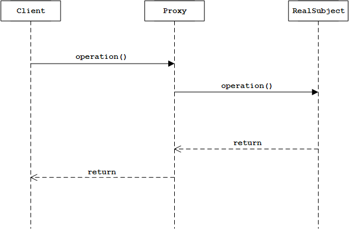
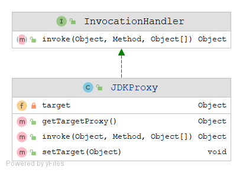
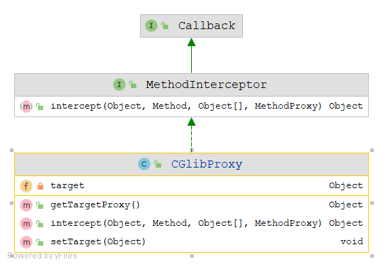
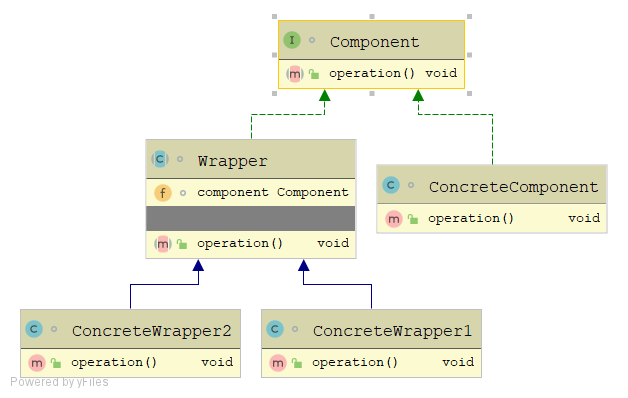
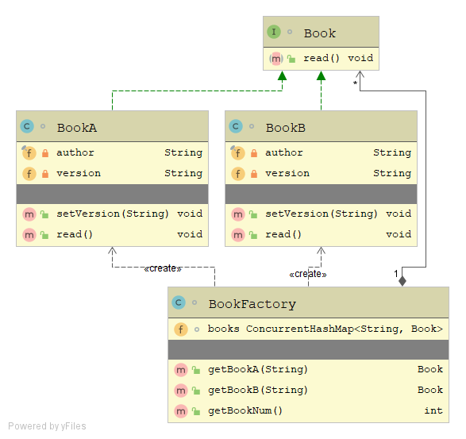
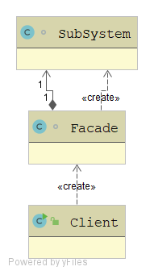
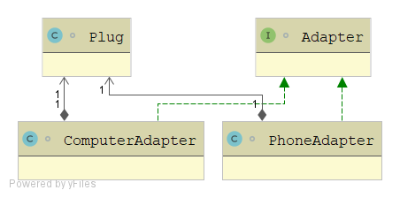
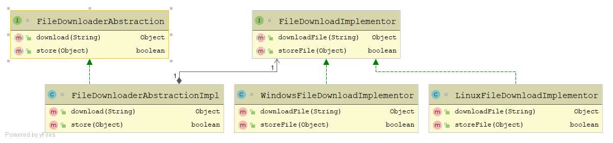

## Structural Patterns

### 1.代理模式

通过代理类对实体类进行增强操作, 客户端直接操作代理类而非实体类. 



#### 静态代理

主要思想: 代理思想, 依赖注入.

示例:


代码:

```java
interface Rentable{
    void rent();
}

public class RentalProxy implements Rentable{

    private Rentable target;

    public void setTarget(Rentable target) {
        this.target = target;
    }

    @Override
    public void rent() {
        try {
            // TODO 前置增强
            this.target.rent();
            // TODO 后置增强
        } catch (Exception e) {
            // TODO
        } finally {
            // TODO
        }
    }
}

class HouseRental implements Rentable{

    @Override
    public void rent() {

    }
}

class CarRental implements Rentable{

    @Override
    public void rent() {

    }
}
```

使用:

```java
RentalProxy rentalProxy = new RentalProxy();
rentalProxy.setTarget(new HouseRetal());
rentalProxy.rent();
```

==不同功能抽象==,需要创建不同的代理.


#### JDK动态代理

主要思想: 代理思想, 依赖注入, 反射.

示例:



代码:

```java
public class JDKProxy implements InvocationHandler {
    private Object target;

    public void setTarget(Object target) {
        this.target = target;
    }

    public Object getTargetProxy() {
        return Proxy.newProxyInstance(target.getClass().getClassLoader(), target.getClass().getInterfaces(), this);
    }

    @Override
    public Object invoke(Object proxy, Method method, Object[] args) throws Throwable {
        Object rtValue = null;
        try {
            // TODO 前置增强
            rtValue = method.invoke(target, args);
            // TODO 后置增强
        } catch (Exception e) {
            // TODO
        } finally {
            // TODO
        }
        return rtValue;
    }
}
```

使用:

```java
JDKProxy proxy = new JDKProxy();
proxy.setTarget(new HouseRental());
Rentable proxy = (Rentable)proxy.getTargetProxy();
proxy.rent();
```


#### CGlib动态代理

主要思想: 代理思想, 依赖注入, 反射.

示例:



代码：

```java
public class CGlibProxy implements MethodInterceptor {
    
    private Object target;

    public void setTarget(Object target) {
        this.target = target;
    }

    public Object getTargetProxy() {
        return Enhancer.create(target.getClass(), this);
    }

    @Override
    public Object intercept(Object proxy, Method method, Object[] args, MethodProxy methodProxy) throws Throwable {
        Object rtValue = null;
        try {
            // TODO 前置增强
            rtValue = method.invoke(target, args);
            // TODO 后置增强
        } catch (Exception e) {
            // TODO
        } finally {
            // TODO
        }
        return rtValue;
    }
}
```

使用：

```java
CGlibProxy proxy = new CGlibProxy();
proxy.setTarget(new HouseRental());
HouseRental proxy = (HouseRental)proxy.getTargetProxy();
proxy.rent();
```

#### 代理模式总结

静态/动态代理异同:

1. 生成代理类方式：静态代理基于编码的方式增加代理类，动态代理基于字节码动态生成技术增加代理
2. 代理的灵活性：一个静态代理类只能代理一种接口的实现类，JDK一个动态代理类能代理所有接口的实现类，CGlib一个动态代理能代理所有类

三种代理的异同点：

1) 静态代理：基于编码的方式增加代理类，代理类与被代理对象实现相同的接口，在代理实现的方法中来增强被代理对象。
2) JDK动态代理：   基于字节码动态生成技术增加代理类，代理类与被代理对象实现相同的接口，在动态代理实现的方法中来增强被代理对象。
3) CGlib动态代理：基于字节码动态生成技术增加代理类，代理类继承自被代理对象，通过方法重写时来增强被代理对象。


### 2.装饰器模式

**动态的将责任附加到对象上, 对于功能扩展得实现, 比扩展方式更具弹性**

与代理模式区别:

- 应该直接访问代理对象,而非被代理对象,
- 装饰器是动态扩展, 可以动态选择被装饰.
- 代理侧重访问控制(远程调用, 安全调用等)
- 装饰器侧重功能增强, 

示例:



代码:

```java
interface Component{
    void operation();
}

class ConcreteComponent implements Component{
    @Override
    public void operation() {
        System.out.println("基础功能");
    }
}

abstract class Wrapper implements Component{
    Component component;
    public Wrapper(Component component){
        this.component = component;
    }
    @Override
    public abstract void operation();
}

class ConcreteWrapper1 extends Wrapper{
    public ConcreteWrapper1(Component component) {
        super(component);
    }

    @Override
    public void operation() {
        this.component.operation();
        System.out.println("增强功能1");
    }
}

class ConcreteWrapper2 extends Wrapper{
    public ConcreteWrapper2(Component component) {
        super(component);
    }

    @Override
    public void operation() {
        this.component.operation();
        System.out.println("增强功能2");
    }
}
```

使用:

```
Component cp = new ConcreteWrapper2(new ConcreteWrapper1(new ConcreteComponent()));
cp.operation();
```

### 3.享元模式

示例:



代码:

```java

interface Book {
    void read();
}

class BookA implements Book {
    private final String author = "路遥";
    private String version;

    public void setVersion(String version) {
        this.version = version;
    }

    @Override
    public void read() {
        System.out.println("read BookA author: " + author + " version: " + version);
    }
}

class BookB implements Book{
    private final String author = "卡勒德";
    private String version;

    public void setVersion(String version) {
        this.version = version;
    }

    @Override
    public void read() {
        System.out.println("read BookB author: " + author + " version: " + version);
    }
}

// 应该做成单例
class BookFactory implements Serializable {
    //    HashMap<String, Book> books = new HashMap<>();
    ConcurrentHashMap<String, Book> books = new ConcurrentHashMap<>();

    // 共享对象的管理
    public Book getBookA(String version) {
        String key = version + "A";

        if (!books.containsKey(key)) {
            BookA book = new BookA();
            book.setVersion(version);
            books.put(key, book);
        }
        return books.get(key);
    }

    public Book getBookB(String version) {
        String key = version + "B";

        if (!books.containsKey(key)) {
            BookB book = new BookB();
            book.setVersion(version);
            books.put(key, book);
        }
        return books.get(key);
    }

    public int getBookNum() {
        return books.size();
    }
}

```

使用:

```java
BookFactory factory = new BookFactory();
Book b1 = factory.getBookA("v1");
b1.read();
Book b2 = factory.getBookA("v2");
b2.read();
Book b3 = factory.getBookA("v1");
b3.read();
Book b4 = factory.getBookB("v1");
b4.read();

System.out.println(factory.getBookNum());

/*
read BookA author: 路遥 version: v1
read BookA author: 路遥 version: v2
read BookA author: 路遥 version: v1
read BookB author: 卡勒德 version: v1
3
*/
```

### 4.门面模式

**提供统一的接口, 用来访问子系统中的一组接口. 外观定义了一个高级接口(逻辑接口, 不是代码接口), 让系统更容易使用.** *比较简单的模式.*

符合**最少知识原则**, 客户应该访问包装好的业务, 而非自己去访问子系统.


示例: 通过访问Facade层调用业务., 而非信息直接访问子系统.



代码:

```java
class Facade{
    SubSystem subSystem;
    Facade(){
        subSystem = new SubSystem();
    }

    void task(){
        subSystem.prepare();
        if(...){
            subSystem.doSomething1();
        }else {
            subSystem.doSomething2();
        }
        subSystem.clean();
    }
}

class SubSystem {
    void prepare(){

    }

    void doSomething1(){

    }

    void doSomething2(){

    }

    void clean(){

    }

}
```

使用:

```java
Facade facade = new Facade();
facade.task();

// 不使用外观模式
//        SubSystem subSystem = new SubSystem();
//        subSystem.prepare();
//        if(true){
//            subSystem.doSomething1();
//        }else {
//            subSystem.doSomething2();
//        }
//        subSystem.clean();
```


### 5.适配器模式

**将一个类的接口, 转换成客户希望的接口. 使得两个不兼容的类, 可以相互合作.** 适配器分为类适配器和对象适配器. 推荐使用**对象适配器**.


对象适配器, 示例:

家用插板输出额定电压220v, 通过电脑适/手机配器, 分别适配手机电脑.




代码:

```java
class Phone {
    void charge(int input){
        System.out.println("手机充电中, 电压: " + input + "V");
    }
}

class Computer {
    void charge(int input){
        System.out.println("电脑充电中, 电压: " + input + "V");
    }
}

interface Adapter {
    // 输出额定电压
    int outputRatedVoltage();
}

// 手机适配器
class PhoneAdapter implements Adapter {
    private Plug plug;

    public PhoneAdapter(Plug plug) {
        this.plug = plug;
    }

    @Override
    public int outputRatedVoltage() {
        int output = plug.output220v();
        output -= 215; // 复杂的转换(适配)过程
        return output;
    }
}


// 手机适配器
class ComputerAdapter implements Adapter {
    private Plug plug;

    public ComputerAdapter(Plug plug) {
        this.plug = plug;
    }

    @Override
    public int outputRatedVoltage() {
        int output = plug.output220v();
        output -= 200; // 复杂的转换(适配)过程
        return output;
    }
}

// 插板
class Plug{
    int output220v(){
        return 220;
    }
}
```

使用:

```java
Plug plug = new Plug();

Phone phone = new Phone();
PhoneAdapter phoneAdapter = new PhoneAdapter(plug);
phone.charge(phoneAdapter.outputRatedVoltage());

Computer computer = new Computer();
ComputerAdapter computerAdapter = new ComputerAdapter(plug);
computer.charge(computerAdapter.outputRatedVoltage());
```

输出:

```
手机充电中, 电压: 5V
电脑充电中, 电压: 20V
```

### 6.桥接模式

**抽象与实现分离,使得他们都可以独立变化,使用组合关系代替继承关系,从而降低了抽象与实现的耦合度.**

桥接（**Bridge**）模式包含以下主要角色。

1. 抽象化（**Abstraction**）角色：定义抽象类，并包含一个对实现化对象的 **引用**。
2. 扩展抽象化（**Refined  Abstraction**）角色：是抽象化角色的子类，实现父类中的业务方法，并通过组合关系调用实现化角色中的业务方法。
3. 实现化（**Implementor**）角色：定义实现化角色的接口，供扩展抽象化角色调用。
4. 具体实现化（**Concrete Implementor**）角色：给出实现化角色接口的具体实现。

示例:



代码:

```java
interface FileDownloaderAbstraction
{
    public Object download(String path);

    public boolean store(Object object);
}

class FileDownloaderAbstractionImpl implements FileDownloaderAbstraction {

    private FileDownloadImplementor provider = null;

    public FileDownloaderAbstractionImpl(FileDownloadImplementor provider) {
        super();
        this.provider = provider;
    }

    @Override
    public Object download(String path)
    {
        return provider.downloadFile(path);
    }

    @Override
    public boolean store(Object object)
    {
        return provider.storeFile(object);
    }
}


interface FileDownloadImplementor
{
    public Object downloadFile(String path);

    public boolean storeFile(Object object);
}

class LinuxFileDownloadImplementor implements FileDownloadImplementor
{
    @Override
    public Object downloadFile(String path) {
        return new Object();
    }

    @Override
    public boolean storeFile(Object object) {
        System.out.println("File downloaded successfully in LINUX !!");
        return true;
    }
}

class WindowsFileDownloadImplementor implements FileDownloadImplementor
{
    @Override
    public Object downloadFile(String path) {
        return new Object();
    }

    @Override
    public boolean storeFile(Object object) {
        System.out.println("File downloaded successfully in WINDOWS !!");
        return true;
    }
}
```

使用:

```java
FileDownloaderAbstraction downloader = null;
downloader = new FileDownloaderAbstractionImpl( new WindowsFileDownloadImplementor() );
```

**使用场景:**

设想如果要绘制矩形、圆形、椭圆、正方形，我们至少需要4个形状类，但是如果绘制的图形需要具有不同的颜色，如红色、绿色、蓝色等

此时至少有如下两种设计方案：

- 第一种设计方案是为每一种形状都提供一套各种颜色的版本.

- **第二种设计方案是根据实际需要对形状和颜色进行组合.**

方案二即是桥接模式的应用,桥接模式将继承关系转换为关联关系，从而降低了类与类之间的耦合，减少了代码编写量。