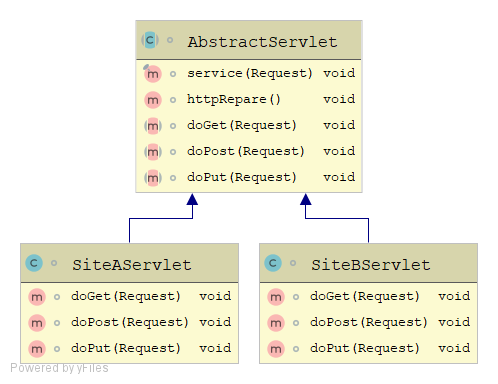
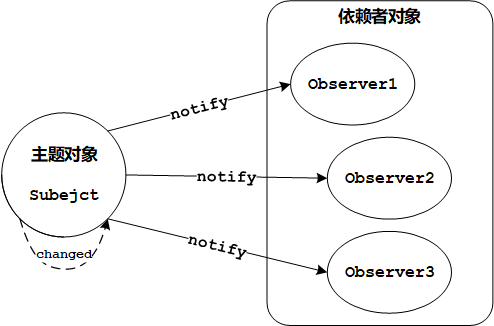
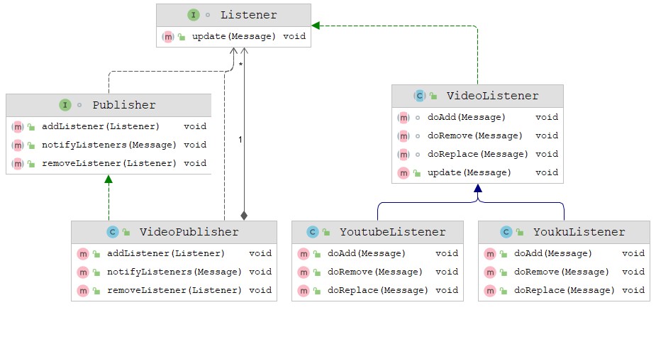
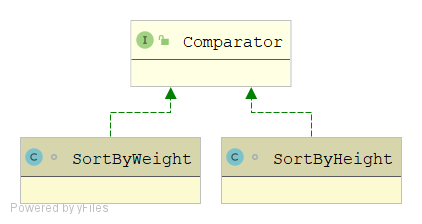
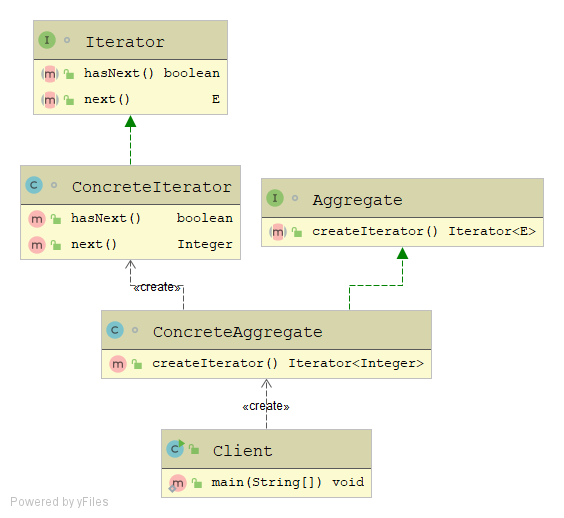
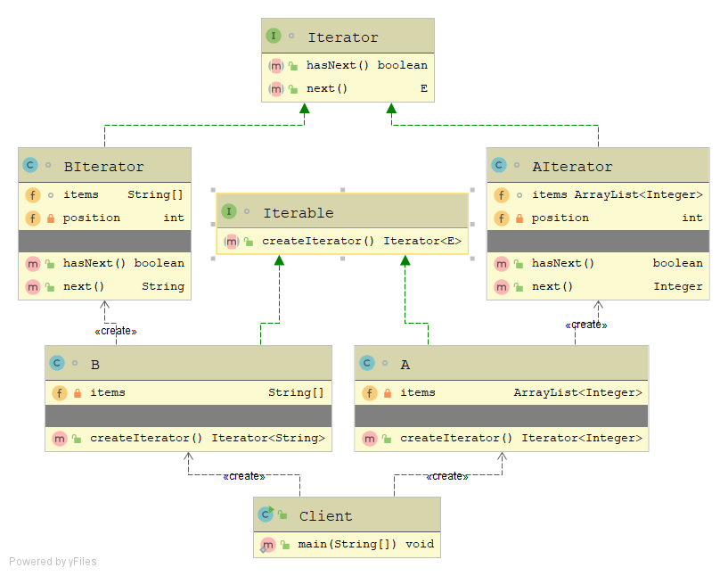

## Behavioral Patterns

### 1.模板方法模式

**在一个方法中定义算法骨架, 具体实现延迟到子类中. 在不改变算法结构的情况下, 自定义具体实现.**

案例:

**JdbcTemplate，用户只需定义需要执行的sql，进行执行即可，无需手动创建Connection，Statement，释放连接等操作**

**模仿HttpServlet, 用户只需自定义doGet/doPost等方法具体实现即可, 无需关系他们如何被调用. 如何被调用由service方法实现, 无需子类自己定义**

- 模板方法(算法骨架): service()
- 具体实现: doGet/doPost/doPut

示例:



代码:

```java
// 模仿HttpRequest
class Request{
    String method;

    public Request(String method) {
        this.method = method;
    }

    public String getMethod() {
        return method;
    }

    public void setMethod(String method) {
        this.method = method;
    }
}

// 模仿 HTTPServlet
abstract class AbstractServlet{
    // 模板, 不希望子类覆盖此方法
    final void service(Request req){
        httpRepare();
        if ("GET".equals(req.getMethod())){
            doGet(req);
        } else if ("POST".equals(req.getMethod())){
            doPost(req);
        }else if ("PUT".equals(req.getMethod())){
            doPut(req);
        }else {
            System.out.println("wrong http method: "+ req.getMethod());
        }
    };
    void httpRepare(){
        System.out.println("HTTP准备工作");
    }
    abstract void doGet(Request req);
    abstract void doPost(Request req);
    abstract void doPut(Request req);
}

class SiteAServlet extends AbstractServlet{

    @Override
    void doGet(Request req) {
        System.out.println("A get");
    }

    @Override
    void doPost(Request req) {
        System.out.println("A post");
    }

    @Override
    void doPut(Request req) {
        System.out.println("A put");
    }
}


class SiteBServlet extends AbstractServlet{

    @Override
    void doGet(Request req) {
        System.out.println("B get");
    }

    @Override
    void doPost(Request req) {
        System.out.println("B post");
    }

    @Override
    void doPut(Request req) {
        System.out.println("B put");
    }
}
```

使用:

```java
Request req = new Request("GET");
SiteAServlet servlet = new SiteAServlet();
servlet.service(req);
```

打印:

```
HTTP准备工作
A get
```


### 2.观察者模式

**观察者模式定义了对象之间的一对多依赖, 当一个对象状态发生改变时,所有依赖者都会接收到通知并自动更新.**

观察者模型:

- 发布者: Subject
- 订阅者: Observer




 案例:

**UP主新增, 删除, 替换 视频后, 通知Youku, Youtube转发器, 分别将行为同步到对应的网站.**

图例:



### 3.策略模式

**定义了算法族, 分别封装起来, 让他们可以相互替换, 客户可以自由选择使用的算法**

示例: 排序元素为自定义类型Person的数组, 可以按照Person的Height/Weight自定义排序规则.

为Comparator算法, 实现一系列规则(算法族, 按身高排序/体重排序), 客户调用时决定使用的算法. 



代码:

```java
class Person{
    private double height;
    private double weight;

    public Person(double height, double weight) {
        this.height = height;
        this.weight = weight;
    }

    public double getHeight() {
        return height;
    }

    public void setHeight(double height) {
        this.height = height;
    }

    public double getWeight() {
        return weight;
    }

    public void setWeight(double weight) {
        this.weight = weight;
    }

    @Override
    public String toString() {
        return "Person{" +
                "height=" + height +
                ", weight=" + weight +
                '}';
    }
}

class SortByHeight implements Comparator<Person> {

    @Override
    public int compare(Person o1, Person o2) {
        if (o1.getHeight() > o2.getHeight()){
            return 1;
        }else if(o1.getHeight() < o2.getHeight()){
            return -1;
        }
        return 0;
    }
}

class SortByWeight implements Comparator<Person>{


    @Override
    public int compare(Person o1, Person o2) {
        if (o1.getWeight() > o2.getWeight()){
            return 1;
        }else if(o1.getWeight() < o2.getWeight()){
            return -1;
        }
        return 0;
    }
}
```

使用:

```java
Person person1 = new Person(170, 120);
Person person2 = new Person(171, 118);
Person person3 = new Person(169, 129);
Person[] people = new Person[]{person1, person2, person3};
// 指定使用算法, 按身高排序
Arrays.sort(people, new SortByHeight());
for (Person person : people) {
System.out.println(person);
}
//按体重排序
Arrays.sort(people, new SortByWeight());
for (Person person : people) {
System.out.println(person);
}
```

输出:

```
Person{height=169.0, weight=129.0}
Person{height=170.0, weight=120.0}
Person{height=171.0, weight=118.0}
Person{height=171.0, weight=118.0}
Person{height=170.0, weight=120.0}
Person{height=169.0, weight=129.0}
```


### 4.迭代器模式

**提供一种方法顺序访问一个聚合对象中的各个元素, 而又不暴露其内部的表示.**

主要角色:

- **Iterator: 封装对外提供迭代功能的逻辑.**

- **Aggregate: 需要对外暴露迭代需求的类.**





示例:



代码:

```java

interface Aggregate<E>{
    Iterator<E> createIterator();
}

interface Iterator<E>{
    boolean hasNext();
    E next();
}

class ConcreteAggregate implements Aggregate<Integer>{

    @Override
    public Iterator<Integer> createIterator() {
        return null;
    }
}

class ConcreteIterator implements Iterator<Integer>{

    @Override
    public boolean hasNext() {
        return false;
    }

    @Override
    public Integer next() {
        return null;
    }
}
```

使用:

```java
Aggregate<Integer> concreteAggregate = new ConcreteAggregate();
Iterator<Integer> iterator = concreteAggregate.createIterator();
while (iterator.hasNext()){
    System.out.println(iterator.next());
}
```

